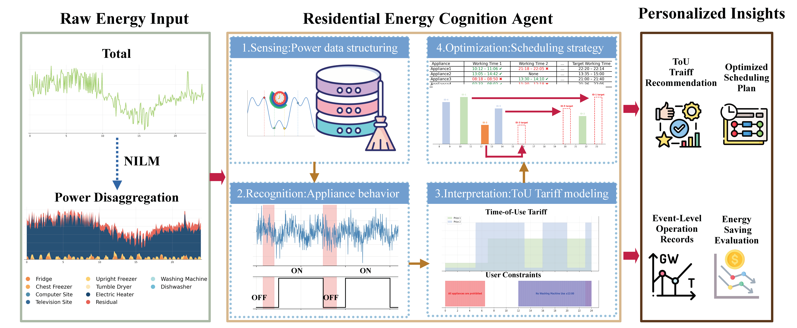

# A Personalized AI Agent for Residential Energy Strategy Optimization under Time-of-Use Tariffs
LLM-powered agent for appliance scheduling and energy cost optimization in smart homes.


# 🏠 Project Introduction

* **Personalized Perception:** Identifying each household's appliance mix, power characteristics, and usage habits.
* **Semantic Understanding:** Extracting scheduling demands and constraint rules from natural language.
* **Tariff Awareness:** Adapting to and leveraging dynamic time-of-use (ToU) tariff models like Economy 7/10.
* **Scheduling Optimization:** Generating highly feasible and low-cost operational plans under multiple constraints.

To address these needs, this project developed an intelligent agent for household appliance energy saving, integrating **Large Language Models (LLM)** with **heuristic scheduling optimization**. The system forms a closed-loop scheduling process centered around four stages: "Perception – Understanding – Reasoning – Optimization." Specifically, it includes:

🧩 Perception

Based on non-intrusive load monitoring (NILM) data (e.g., REFIT), it aligns total power with individual appliance power, removes anomalies, unifies granularity, and extracts appliance operating event segments (start/end time, power, energy consumption).

🧠 Understanding

Leveraging Large Language Models (e.g., GPT), it automatically identifies appliance names, usage contexts, and preference constraints from user input, generating structured scheduling rules and parameters (e.g., prohibited operating times, latest completion time, shift direction).

🧮 Reasoning

By combining user rules with the electricity tariff model, it assesses the legality of shifting each event, constructs multi-dimensional operating intervals and scheduling spaces, and predicts the cost impact of shifts.

🔧 Optimization

It employs a heuristic search algorithm to select time slots from candidate operating intervals that satisfy constraints and offer the lowest electricity price, generating a feasible event schedule. It then provides a cost comparison and energy-saving evaluation between the original and optimized schedules.

This project implements a complete Agent control logic and modular toolchain, supporting the following application scenarios:

* **🎓 Academic Research:** Tariff-response scheduling, semantic constraint modeling, NILM identification, and multi-agent optimization.
* **🏠 Smart Home System Prototype Validation:** Integrating household electrical equipment for edge-side scheduling.
* **💡 Energy-Saving Platform & Industry Application Embedding:** Providing clear module interfaces to support parallel scheduling tests for multiple households/tariff schemes.


## 🎥 Demo Video

[](https://www.bilibili.com/video/BV155uczNEAg/?vd_source=d8e9eb9364c3b4a350eb8b788cdc8d9f)


## 📊 Dataset Used: REFIT Appliance-Level Energy Data

We use the public dataset **REFIT**, provided by Loughborough University in the UK, as our primary experimental data. Its characteristics include:

* Records minute-level appliance power data for 20 households between 2013–2015.
* Covers major household appliances such as refrigerators, washing machines, dryers, and televisions.
* Each household includes total power (Aggregate) and multiple sub-appliances.
* Suitable for research tasks such as NILM, tariff response, and scheduling optimization.

🔗 Dataset Link: [REFIT Dataset](https://pureportal.strath.ac.uk/en/projects/personalised-retrofit-decision-support-tools-for-uk-homes-using-s/datasets/)

In this project, the data undergoes multi-resolution alignment, anomaly removal, and behavioral modeling to prepare it for Agent input.


---
## 🧠 System Architecture and Workflow

End‑to‑end workflow (integrated runners):
- `test_func_2_int.py` — Perception alignment, event segmentation, shiftability, event ID
  - Uses: tools/p_01_perception_alignment.py, tools/p_02_segment_events.py, tools/p_02_shiftable_identifier.py, tools/p_02_event_id.py
- `test_func_3_int.py` — Tariff modeling and baseline cost analysis
  - Uses: tools/p_03_tariff_modeling.py, tools/p_03_energy_summary.py
- `test_func_4_int.py` — Appliance list standardization and summaries
  - Uses: tools/p_041_get_appliance_list.py
- `test_func_5_int.py` — User constraints (NL→JSON), min‑duration filtering, TOU optimization
  - Uses: tools/p_042_user_constraints.py, tools/p_043_min_duration_filter.py, tools/p_044_tou_optimization_filter.py
- `test_func_6_int.py` — Scheduling spaces, event scheduling, collision resolution, event split
  - Uses: tools/p_051_appliance_space_generator.py, tools/p_052_event_scheduler.py, tools/p_053_collision_resolver.py, tools/p_054_event_splitter.py
- `test_func_7_int.py` — Final cost calculation and summaries
  - Uses: tools/p_061_cost_cal.py
- Plotting CLI — Monthly trends across households
  - Uses: tools/plot_monthly_cost_comparison.py

Unified interactive entry orchestrates all stages: `main_personal_household_tariff_scheduling_AI_agent.py`.
Each `test_func_*` can run independently for experiments.

---

## 🚀 Quick Start Guide

### ✅ Environment Setup

```bash
pip install -r requirements.txt
conda activate your_env_name
````

### ✅ Launch the Agent

```bash
export open_api_key=your_api_key
```

```bash
python main_personal_household_tariff_scheduling_AI_agent.py
```

You will experience a complete conversational flow, including appliance identification, tariff analysis, scheduling, and energy-saving feedback.

-----

## ⚙️ User Configuration Instructions (Basic Settings)

If you wish to customize or extend this project, update the following:

| File or Location | Description |
| :--- | :--- |
| `settings.py` | Set LLM credentials and endpoint: `ai_easy_api_key`, `llm_url`, `llm_model4mini`, `http_timeout`. |
| `config/house_appliances.json` | Define appliances per household (REFIT). Add or rename appliances for your own data. |
| `config/tariff_config.json` | Select or extend tariff schemes (UK/Economy7/10, TOU_D, Germany). |
| `tools/p_01_perception_alignment.py` | Adjust input data path(s) used by the preprocessing/alignment pipeline to point to your raw CSV(s). |
| `main_personal_household_tariff_scheduling_AI_agent.py` | Provide the initial prompt like `house1, uk, single` to drive the end‑to‑end workflow (LLM conversation mode). |
| `test_func_*.py` (optional) | Run or modify these for step‑wise debugging of individual stages. |

-----

## 🛠️ User Constraint Settings (Optional Extension)

| File or Location | Description |
| :--- | :--- |
| `config/appliance_constraints.json` | Stores structured rules after LLM parsing. You can seed defaults here or let the system save them automatically. |
| `main_personal_household_tariff_scheduling_AI_agent.py` | Provide natural‑language rules in conversation, e.g.: “Washing Machine not allowed 23:00–06:30; must finish by 14:00 next day”. The agent parses and applies them. |

The system will call GPT to automatically structure these into a rule table and filter/shift operating events based on them.

-----

## 🧪 Recommended Experiment Workflow

1. Open `config/house_appliances.json` and select a household (e.g., `house1`).
2. Run the interactive entry:
   ```bash
   python main_personal_household_tariff_scheduling_AI_agent.py
   ```
   Provide an initial prompt such as:
   ```
   house1, uk, single
   ```
3. Inspect outputs under `output/`:

| Path | Description |
| :--- | :--- |
| `01_preprocessed/` | 🌐 Raw data alignment/cleaning/resampling for downstream modeling. |
| `02_behavior_modeling/` | 📌 Appliance semantics and shiftability (LLM‑assisted). |
| `02_event_segments/` | 📊 Extracted event segments per appliance (start/end, duration, energy). |
| `03_cost_analysis/` | 💰 Baseline multi‑tariff cost analysis and comparisons. |
| `04_user_constraints/` | 🔐 User rule parsing results (from NL → JSON). |
| `04_min_duration_filter/` | ⏱️ Events filtered by minimum duration feasibility. |
| `04_TOU_filter/` | 🧭 Feasible windows after TOU optimization filtering. |
| `05_appliance_working_spaces/` | 🧩 Generated scheduling spaces per appliance. |
| `05_Initial_scheduling_optimization/` | ⚙️ Initial scheduling plan before conflict resolution. |
| `05_Collision_Resolved_Scheduling/` | � Collision‑resolved schedule. |
| `05_event_split/` | ✂️ Post‑processing with event splitting when needed. |
| `05_scheduling/` | 📅 Final scheduling results. |
| `06_cost_cal/` | 🧮 Final cost calculation post scheduling. |
| `Monthly_cost_trends/` | 📈 Monthly plots by household. |

-----


## 📊 Example Visualization Results

| Total Cost and Recommended Plan under Different Interval Tariffs |
| 
|  |

| Monthly Energy Saving Comparison | Appliance-Specific Saving Distribution |
|  |  |


-----


## 📁 Modules and Tool Composition

### 🛠️ Tool Module Description (Partial)

| Module Path | Function Description |
| :--- | :--- |
| `tools/p_01_perception_alignment.py` | Alignment/cleaning/resampling of raw power data. |
| `tools/p_02_shiftable_identifier.py` | LLM‑assisted appliance semantics and shiftability inference. |
| `tools/p_02_segment_events.py` | Event extraction (start/end/duration/energy) and basic features. |
| `tools/p_03_tariff_modeling.py` | Multi‑tariff cost simulation and baseline comparison. |
| `tools/p_03_energy_summary.py` | Energy/cost summaries by time and appliance. |
| `tools/p_041_get_appliance_list.py` | Appliance lists and ID mapping utilities. |
| `tools/p_042_user_constraints.py` | NL → JSON user rule parsing. |
| `tools/p_043_min_duration_filter.py` | Feasibility filtering by minimum duration. |
| `tools/p_044_tou_optimization_filter.py` | TOU‑aware feasible window optimization. |
| `tools/p_051_appliance_space_generator.py` | Generate per‑appliance scheduling spaces. |
| `tools/p_052_event_scheduler.py` | Schedule events within feasible spaces. |
| `tools/p_053_collision_resolver.py` | Resolve scheduling collisions. |
| `tools/p_054_event_splitter.py` | Optional event splitting post scheduling. |
| `tools/p_061_cost_cal.py` | Final cost calculation and reports. |
| `tools/plot_monthly_cost_comparison.py` | Batch plotting CLI for monthly trends. |
| `tools/llm_proxy.py` | GPT API wrapper used for NL parsing of constraints. |

### 📦 Agent Main Control Logic

  * `main_personal_household_tariff_scheduling_AI_agent.py`: Unified interactive entrypoint that orchestrates the full pipeline.

  * `test_func_*.py`: Optional per‑module runners for focused debugging.

-----

## 📄 Citation and License

This project is open-sourced under the MIT License. Contributions and references are welcome:

```bibtex
@project{TariffSchedulingAgent,
  title={A Personalized AI Agent for Residential Energy Strategy Optimization under Time-of-Use Tariffs},
  author={Zhiqiang Chen},
  year={2025},
  url={[https://github.com/Andychen2018/A-Personalized-AI-Agent-for-Residential-Energy-Strategy-Optimization-under-Time-of-Use-Tariffs](https://github.com/Andychen2018/A-Personalized-AI-Agent-for-Residential-Energy-Strategy-Optimization-under-Time-of-Use-Tariffs)}
  }
```

-----

## 🔮 Future Plans

  * [ ] Integrate Reinforcement Learning (DQN) scheduler.
  * [ ] Connect with a Web frontend for user-friendly interaction.
  * [ ] Expand to more tariff mechanisms (e.g., Real-Time Pricing RTP).
  * [ ] Support multi-household joint optimization and regional-level scheduling collaboration.

-----

## File Structure Overview

```plaintext
.
├── config/                               # Configuration files
│   ├── house_appliances.json                     # Household appliance lists (REFIT)
│   ├── tariff_config.json                        # Tariff schemes (UK/Economy7/10, TOU_D, Germany)
│   ├── device_threshold_dict.json                # Default Pmin/Tmin thresholds
│   ├── appliance_shiftability_dict.json          # Appliance shiftability dictionary
│   ├── Germany_Variable.json                     # Regional tariff config (example)
│   ├── TOU_D.json                                # TOU_D tariff config
│   ├── user_instruction.txt                      # Sample user instruction (NL)
│   └── defaullt_user_constrain.txt               # Default user constraints (NL)

├── tools/                                # Modular pipeline components
│   ├── p_01_perception_alignment.py              # Alignment and preprocessing
│   ├── p_02_segment_events.py                    # Event extraction
│   ├── p_02_event_id.py                          # Event ID mapping/utilities
│   ├── p_02_shiftable_identifier.py              # LLM‑assisted semantics & shiftability
│   ├── p_03_tariff_modeling.py                   # Tariff modeling and cost simulation
│   ├── p_03_energy_summary.py                    # Energy/cost summaries
│   ├── p_041_get_appliance_list.py               # Appliance list + ID mapping
│   ├── p_042_user_constraints.py                 # NL → JSON user rule parsing
│   ├── p_043_min_duration_filter.py              # Min‑duration feasibility filter
│   ├── p_044_tou_optimization_filter.py          # TOU optimization filter
│   ├── p_051_appliance_space_generator.py        # Scheduling space generation
│   ├── p_052_event_scheduler.py                  # Event scheduling
│   ├── p_053_collision_resolver.py               # Collision resolution
│   ├── p_054_event_splitter.py                   # Optional event splitting
│   ├── p_061_cost_cal.py                         # Final cost calculation
│   ├── plot_monthly_cost_comparison.py           # Batch plotting CLI
│   └── llm_proxy.py                              # GPT API wrapper

├── output/                               # All intermediate and final results
│   ├── 01_preprocessed/                           # Preprocessing outputs
│   ├── 02_behavior_modeling/                      # Semantics/shiftability modeling
│   ├── 02_event_segments/                         # Extracted event segments
│   ├── 03_cost_analysis/                          # Baseline cost analysis
│   ├── 04_appliance_summary/                      # Appliance summaries
│   ├── 04_min_duration_filter/                    # Min‑duration filter results
│   ├── 04_TOU_filter/                             # TOU filter results
│   ├── 04_user_constraints/                       # Parsed user constraints
│   ├── 05_appliance_working_spaces/               # Generated scheduling spaces
│   ├── 05_Initial_scheduling_optimization/        # Initial schedule (pre‑collision)
│   ├── 05_Collision_Resolved_Scheduling/          # Collision‑resolved schedule
│   ├── 05_event_split/                            # Post‑split events
│   ├── 05_scheduling/                             # Final scheduling results
│   ├── 06_cost_cal/                               # Final cost calculation
│   └── Monthly_cost_trends/                       # Monthly plots by household

├── experiments/                         # Reproducible experiments
│   ├── Ablation_experiments/
│   ├── BaselineComparison/
│   ├── Cross_Validation/
│   ├── Robustness/
│   └── Statistical_Significance_Testing/

├── main_personal_household_tariff_scheduling_AI_agent.py  # Unified interactive entry
├── settings.py                           # LLM/API configuration
├── llm.py                                # LLM client façade
├── test_func_2_int.py                    # Module debug entry (semantics/shiftability)
├── test_func_3_int.py
├── test_func_4_int.py
├── test_func_5_int.py
├── test_func_6_int.py
├── test_func_7_int.py
├── README.md

```