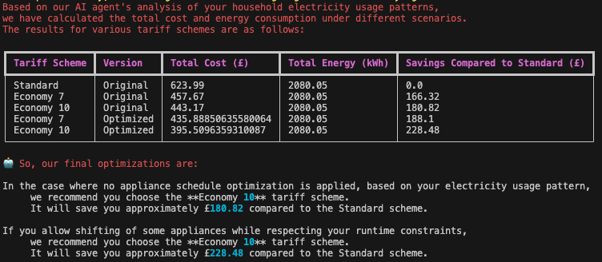
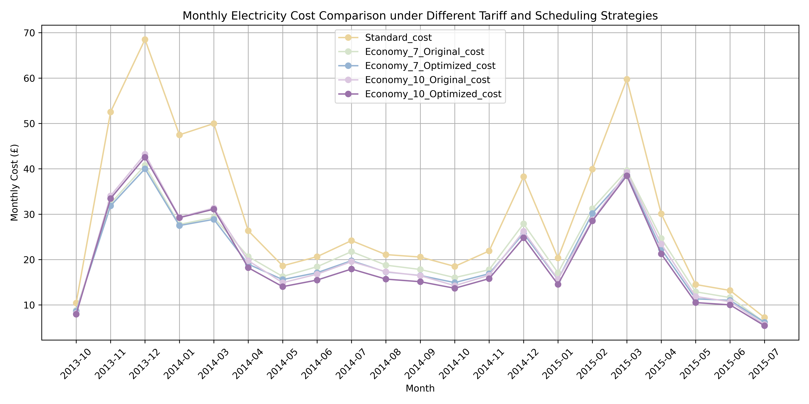
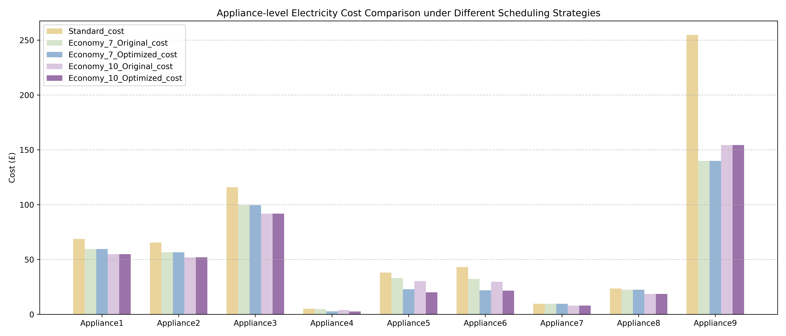

I've prepared the `README.md` content for you. Since I can't directly provide a downloadable file in this chat interface, I'll give you the complete Markdown code.

To use it, simply **copy all the text** below this message and **paste it into a new file** named `README.md` on your computer.

-----

```markdown
# A Personalized AI Agent for Residential Energy Strategy Optimization under Time-of-Use Tariffs

LLM-powered agent for appliance scheduling and energy cost optimization in smart homes.

---

## 🏠 Project Introduction

* **Personalized Perception:** Identifying each household's appliance mix, power characteristics, and usage habits.
* **Semantic Understanding:** Extracting scheduling demands and constraint rules from natural language.
* **Tariff Awareness:** Adapting to and leveraging dynamic time-of-use (ToU) tariff models like Economy 7/10.
* **Scheduling Optimization:** Generating highly feasible and low-cost operational plans under multiple constraints.

To address these needs, this project developed an intelligent agent for household appliance energy saving, integrating **Large Language Models (LLM)** with **heuristic scheduling optimization**. The system forms a closed-loop scheduling process centered around four stages: "Perception – Understanding – Reasoning – Optimization." Specifically, it includes:

### 🧩 Perception

Based on non-intrusive load monitoring (NILM) data (e.g., REFIT), it aligns total power with individual appliance power, removes anomalies, unifies granularity, and extracts appliance operating event segments (start/end time, power, energy consumption).

### 🧠 Understanding

Leveraging Large Language Models (e.g., GPT), it automatically identifies appliance names, usage contexts, and preference constraints from user input, generating structured scheduling rules and parameters (e.g., prohibited operating times, latest completion time, shift direction).

### 🧮 Reasoning

By combining user rules with the electricity tariff model, it assesses the legality of shifting each event, constructs multi-dimensional operating intervals and scheduling spaces, and predicts the cost impact of shifts.

### 🔧 Optimization

It employs a heuristic search algorithm to select time slots from candidate operating intervals that satisfy constraints and offer the lowest electricity price, generating a feasible event schedule. It then provides a cost comparison and energy-saving evaluation between the original and optimized schedules.

This project implements a complete Agent control logic and modular toolchain, supporting the following application scenarios:

* **🎓 Academic Research:** Tariff-response scheduling, semantic constraint modeling, NILM identification, and multi-agent optimization.
* **🏠 Smart Home System Prototype Validation:** Integrating household electrical equipment for edge-side scheduling.
* **💡 Energy-Saving Platform & Industry Application Embedding:** Providing clear module interfaces to support parallel scheduling tests for multiple households/tariff schemes.

---

## 📊 Dataset Used: REFIT Appliance-Level Energy Data

We use the public dataset **REFIT**, provided by Loughborough University in the UK, as our primary experimental data. Its characteristics include:

* Records minute-level appliance power data for 20 households between 2013–2015.
* Covers major household appliances such as refrigerators, washing machines, dryers, and televisions.
* Each household includes total power (Aggregate) and multiple sub-appliances.
* Suitable for research tasks such as NILM, tariff response, and scheduling optimization.

🔗 Dataset Link: [REFIT Dataset](https://pureportal.strath.ac.uk/en/projects/personalised-retrofit-decision-support-tools-for-uk-homes-using-s/datasets/)

In this project, the data undergoes multi-resolution alignment, anomaly removal, and behavioral modeling to prepare it for Agent input.


---

## 🧠 System Architecture and Workflow
```

Raw Power Data
↓
Alignment & Modeling (1-min granularity) ← p\_01\_perception\_alignment
↓
Appliance Semantic Recognition + Shiftability Classification ← p\_02\_shiftable\_identifier
↓
Operating Event Extraction (StartTime-EndTime-Energy) ← p\_02\_segment\_events
↓
Cost Simulation under Multi-Interval Tariffs (Multi-Tariff) & Initial Recommendation ← p\_03\_tariff\_modeling
↓
User Natural Language Constraint Parsing ← p\_042\_user\_constraints + llm\_proxy
↓
Candidate Scheduling Event Filtering → Heuristic Scheduling of Scheduling Intervals → Event Collision Resolution ← p\_051\~p\_053
↓
Cost and Energy Saving Comparison Analysis & Final Recommendation → Visualization ← p\_054\_tariff\_cost\_analyzer

````

All processes are uniformly orchestrated by the Agent control flow, and tools support independent testing.

---

## 🚀 Quick Start Guide

### ✅ Environment Setup

```bash
pip install -r requirements.txt
conda activate your_env_name
````

### ✅ Launch the Agent

```bash
export open_api_key=your_api_key
```

```bash
python personal_household_tariff_scheduling_agent.py
```

You will experience a complete conversational flow, including appliance identification, tariff analysis, scheduling, and energy-saving feedback.

-----

## ⚙️ User Configuration Instructions (Basic Settings)

If you wish to improve this project, you can modify the following sections to suit your work:

| File or Location | Description |
| :--- | :--- |
| `open_api_key` | Set LLM API credentials, configurable via environment variable or in `config.py`. |
| `tools/p_01_perception_alignment.py` | Modify `raw_csv_path` to specify the raw power data (REFIT single household). |
| `test_func_2_int.py` | In the conversation section within `if __name__ == "__main__":`, provide the name of the test appliance (recommended from `house_appliances.json`), or use your own appliance names. |
| `personal_household_tariff_scheduling_agent.py` | In the first query after `if __name__ == "__main__":`, provide the appliance name as natural language input for the Agent to parse. |

-----

## 🛠️ User Constraint Settings (Optional Extension)

| File or Location | Description |
| :--- | :--- |
| `appliance_constraints.json` | Default rule definitions (natural language rules set in this document, automatically saved to `./config/appliance_constraints.json` after LLM parsing). |
| `personal_household_tariff_scheduling_agent.py` | Customizable natural language rules, for example:\<br\>"Washing Machine is not allowed to run between 23:00–6:30 and must be completed before 14:00 the next day";\<br\>"Dishwasher is only allowed to be delayed." |

The system will call GPT to automatically structure these into a rule table and filter/shift operating events based on them.

-----

## 🧪 Recommended Experiment Workflow

1.  Open `config/house_appliances.json` and select any household (e.g., `House1`).
2.  Enter its appliances into the Agent launch script `personal_household_tariff_scheduling_agent.py`, specifically in the first query after `if __name__ == "__main__":`.
3.  Launch the main program and observe the output paths:

| Path | Description |
| :--- | :--- |
| `01_preprocessed/` | 🌐 Raw power data alignment and granularity unification (e.g., 1-minute), preparing for behavioral modeling. |
| `02_behavior_modeling/` | 📌 Appliance semantic recognition and shiftability classification (Shiftable / Non-shiftable / Base). |
| `02_event_segments/` | 📊 Extraction of operating event segments for each appliance (start/end time, duration, energy consumption). |
| `03_cost_cal/` | 💰 Cost simulation under multiple tariffs for the original unscheduled conditions, establishing a baseline. |
| `04_user_constraints/` | 🔐 Parsing user constraint rules and filtering event legality (using default or LLM parsing). |
| `05_scheduling/` | 📅 Scheduled optimization results (StartTime/EndTime updated). |
| `06_tariff/` | 🔍 Distribution statistics of events in high/low tariff periods before and after scheduling. |
| `07_cost_analysis/` | 📈 Graphs and statistical results of cost savings before and after scheduling. |

-----


## 📊 Example Visualization Results

| Total Cost and Recommended Plan under Different Interval Tariffs |
| 
|  |

| Monthly Energy Saving Comparison | Appliance-Specific Saving Distribution |
|  |  |


-----


## 📁 Modules and Tool Composition

### 🛠️ Tool Module Description (Partial)

| Module Path | Function Description |
| :--- | :--- |
| `tools/p_01_perception_alignment.py` | Time alignment and granularity unification processing of raw power data. |
| `tools/p_02_shiftable_identifier.py` | LLM identifies appliance semantics → Infers Shiftability and Pmin/Tmin. |
| `tools/p_02_segment_events.py` | Extracts operating event segments using a dual-threshold method (based on power sequence). |
| `tools/p_03_tariff_modeling.py` | Simulates operating costs based on events and tariff models. |
| `tools/p_03_energy_summary.py` | Statistics of energy consumption and costs for various appliances by year, month, and day. |
| `tools/p_041_get_appliance_list.py` | Extracts appliances and their ID mappings from the dataset. |
| `tools/p_042_user_constraints.py` | Converts natural language scheduling rules → standard JSON structure. |
| `tools/p_043_filter_shiftable_events.py` | Filters legitimate shiftable events by combining constraint rules and tariff models. |
| `tools/p_051_base_scheduler.py` | Heuristic scheduling algorithm: finds optimal time slots based on allowed intervals. |
| `tools/p_052_conflict_resolver.py` | Detects scheduling conflicts and resolves them by shifting or merging. |
| `tools/p_053_tariff_input_builder.py` | Constructs scheduling input structure: tariff vector + legitimate operating intervals. |
| `tools/p_054_tariff_cost_analyzer.py` | Evaluates scheduling results costs and generates charts. |
| `tools/llm_proxy.py` | GPT API encapsulation: calls `GPTProxyClient.chat()` to interact with LLMs, converting natural language → JSON structure. |

### 📦 Agent Main Control Logic

  * `personal_household_tariff_scheduling_agent.py`: Main process control.
  * `test_func_*.py`: Individual entry points and debugging interfaces for each module. `test_func_1.py` is for displaying final analysis results, while `2-6` are tools for various stages.

-----

## 📄 Citation and License

This project is open-sourced under the MIT License. Contributions and references are welcome:

```bibtex
@project{TariffSchedulingAgent,
  title={A Personalized AI Agent for Residential Energy Strategy Optimization under Time-of-Use Tariffs},
  author={Zhiqiang Chen},
  year={2025},
  url={[https://github.com/Andychen2018/A-Personalized-AI-Agent-for-Residential-Energy-Strategy-Optimization-under-Time-of-Use-Tariffs](https://github.com/Andychen2018/A-Personalized-AI-Agent-for-Residential-Energy-Strategy-Optimization-under-Time-of-Use-Tariffs)}
  }
```

-----

## 🔮 Future Plans

  * [ ] Integrate Reinforcement Learning (DQN) scheduler.
  * [ ] Connect with a Web frontend for user-friendly interaction.
  * [ ] Expand to more tariff mechanisms (e.g., Real-Time Pricing RTP).
  * [ ] Support multi-household joint optimization and regional-level scheduling collaboration.

-----

## File Structure Overview

```plaintext
.
├── config/                         # 📄 Configuration files (system default parameters and device dictionary)
│   ├── appliance_constraints.json           # Agent's default generated appliance constraints (prohibited times, completion times, shift rules, etc.)
│   ├── appliance_shiftability_dict.json     # Dictionary of common household appliance shiftability (Chinese/English + Shiftability tags)
│   ├── device_threshold_dict.json           # Default Pmin / Tmin operating thresholds for common household appliances
│   ├── house_appliances.json                # List of appliances included in each household from the REFIT dataset (for testing and switching)
│   └── tariff_config.json                   # Tariff mechanism configuration for simulating UK basic tariffs, interval tariffs (Economy_7, Economy_10)

├── output/                         # 🧾 All intermediate and final results (categorized by stage)
│   ├── 01_preprocessed/            → Raw power data alignment and anomaly removal
│   ├── 02_behavior_modeling/       → Appliance semantic recognition and scheduling capability modeling
│   ├── 02_event_segments/          → Extraction of operating event segments (start/end time, energy consumption, duration)
│   ├── 03_cost_cal/                → Simulation of original operating costs under different tariffs
│   ├── 04_user_constraints/        → Parsing user scheduling rules and event filtering
│   ├── 05_scheduling/              → Optimized scheduling results (StartTime/EndTime updated)
│   ├── 06_tariff/                  → Comparison of events before and after shifting under different tariffs
│   └── 07_cost_analysis/           → Scheduling cost analysis and image visualization output

├── tools/                         # 🛠️ Functional tool modules (supporting Agent calls)
│   ├── p_01_perception_alignment.py         # Time alignment and granularity unification processing of raw power data
│   ├── p_02_shiftable_identifier.py         # LLM identifies appliance semantics → Infers Shiftability and Pmin/Tmin
│   ├── p_02_segment_events.py               # Extracts operating event segments using a dual-threshold method (based on power sequence)
│   ├── p_03_tariff_modeling.py              # Simulates operating costs based on events and tariff models
│   ├── p_03_energy_summary.py               # Statistics of energy consumption and costs for various appliances by year, month, and day.
│   ├── p_041_get_appliance_list.py          # Extracts appliances and their ID mappings from the dataset
│   ├── p_042_user_constraints.py            # Converts natural language scheduling rules → standard JSON structure
│   ├── p_043_filter_shiftable_events.py     # Filters legitimate shiftable events by combining constraint rules and tariff models
│   ├── p_051_base_scheduler.py              # Heuristic scheduling algorithm: finds optimal time slots based on allowed intervals
│   ├── p_052_conflict_resolver.py           # Detects scheduling conflicts and resolves them by shifting or merging
│   ├── p_053_tariff_input_builder.py        # Constructs scheduling input structure: tariff vector + legitimate operating intervals
│   ├── p_054_tariff_cost_analyzer.py        # Evaluates scheduling results costs and generates charts
│   └── llm_proxy.py                         # GPT API wrapper: provides GPTProxyClient.chat() method to interact with LLMs, converting natural language → JSON structure

├── test_func_1_int.py             # Tool 1: Summarizes simulated costs and recommends the optimal tariff plan
├── test_func_2_int.py             # Tool 2: Identifies appliance names and Shiftability types
├── test_func_3_int.py             # Tool 3: Executes tariff simulation and output recommendation
├── test_func_4_int.py             # Tool 4: Outputs system default scheduling rules (e.g., prohibited periods)
├── test_func_5_int.py             # Tool 5: Filters legitimate shiftable events based on user rules
├── test_func_6_int.py             # Tool 6: Analyzes and visualizes the relationship between events and tariffs before and after scheduling

├── personal_household_tariff_scheduling_agent.py  # ✅ Main entry point: Agent control + tool linkage
├── llm.py                         # LLM unified interface encapsulation (e.g., underlying implementation of chat_with_api)
├── plot_cost_summary.py           # Final cost graph plotting (e.g., monthly comparison, distribution by appliance/type)
├── config.py                      # LLM model configuration, where users fill in their open_api_key
├── requirements.txt               # Python environment dependency file
```