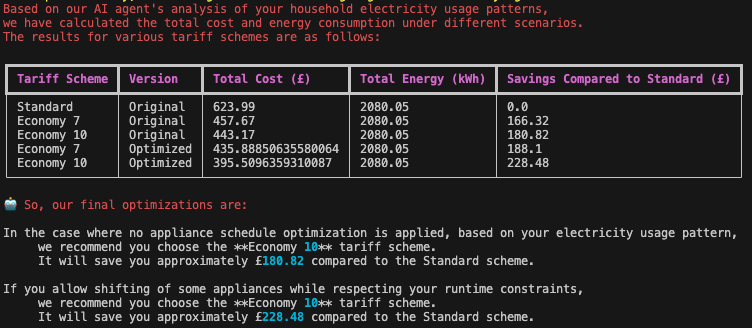
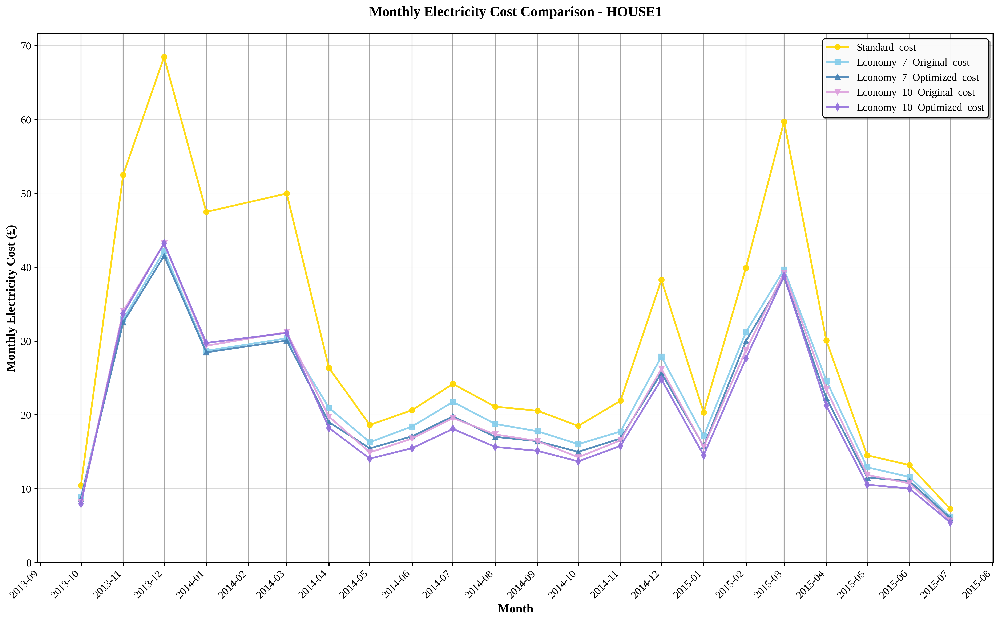
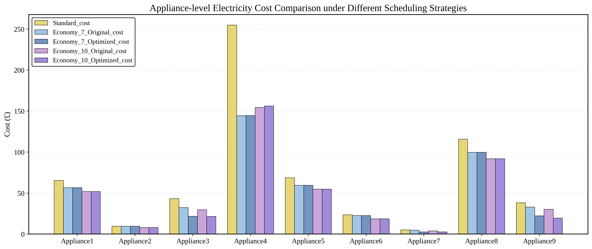

# 面向分时电价的个性化家庭用能策略优化智能体
基于大语言模型（LLM）的家电调度与电费优化智能体。


## 🏠 项目介绍

- 个性化感知：识别每个家庭的电器构成、功率特征与使用习惯。
- 语义理解：从自然语言中抽取调度诉求与约束规则。
- 电价感知：适配并利用 Economy 7/10 等分时电价（ToU）模型。
- 调度优化：在多重约束下生成可执行、低成本的运行计划。

本项目将 LLM 与启发式调度优化结合，围绕“感知—理解—推理—优化”四阶段构建闭环调度流程，并实现了完整的 Agent 控制逻辑与模块化工具链，适用于：

- 🎓 学术研究：电价响应调度、语义约束建模、NILM 识别、多智能体优化；
- 🏠 智能家居原型：集成家庭电器进行端侧调度；
- 💡 节能平台/行业嵌入：模块接口清晰，支持多户/多电价并行测试。

感知：基于 NILM（如 REFIT）分钟级数据，对总功率与分电器功率对齐、去噪、统一粒度，并提取电器运行事件段（起止时间、功率、能耗）。

理解：利用 LLM（如 GPT）从用户输入中识别电器名称、使用语境与偏好约束，生成结构化调度规则（如禁止时段、最晚完成时间、偏移方向）。

推理：结合用户规则与电价模型，判断事件可转移性，构建多维运行区间与调度空间，预测转移前后的成本影响。

优化：采用启发式搜索在可行区间内选择满足约束且电价最低的时间点，生成可执行的事件日程，并对原始/优化方案进行费用对比与节能评估。

---

## 🎥 演示视频
<video src="./demo.mp4" controls width="700"></video>

---

## 📊 数据集：REFIT（按电器级别）

本项目使用英国拉夫堡大学提供的公开数据集 **REFIT** 作为主要实验数据，其特点包括：
- 记录了 2013–2015 年间 20 户家庭的分钟级电器功率。
- 覆盖冰箱、洗衣机、干衣机、电视等主要家电。
- 每户包含总功率（Aggregate）及多个分电器通道。
- 适用于 NILM、电价响应、调度优化等研究。

🔗 数据集链接：[REFIT Dataset](https://pureportal.strath.ac.uk/en/projects/personalised-retrofit-decision-support-tools-for-uk-homes-using-s/datasets/)

在本项目中，数据经过多分辨率对齐、异常去除与行为建模，作为 Agent 的输入基础。

---

## 🧠 系统架构与工作流

端到端流程（集成 Runner）：
- `test_func_2_int.py` — 感知对齐、事件分割、可转移性、事件 ID
  - 使用：tools/p_01_perception_alignment.py, tools/p_02_segment_events.py, tools/p_02_shiftable_identifier.py, tools/p_02_event_id.py
- `test_func_3_int.py` — 电价建模与基线成本分析
  - 使用：tools/p_03_tariff_modeling.py, tools/p_03_energy_summary.py
- `test_func_4_int.py` — 电器清单标准化与汇总
  - 使用：tools/p_041_get_appliance_list.py
- `test_func_5_int.py` — 用户约束（自然语言→JSON）、最小时长过滤、TOU 优化
  - 使用：tools/p_042_user_constraints.py, tools/p_043_min_duration_filter.py, tools/p_044_tou_optimization_filter.py
- `test_func_6_int.py` — 调度空间、事件调度、冲突消解、事件拆分
  - 使用：tools/p_051_appliance_space_generator.py, tools/p_052_event_scheduler.py, tools/p_053_collision_resolver.py, tools/p_054_event_splitter.py
- `test_func_7_int.py` — 最终成本计算与汇总
  - 使用：tools/p_061_cost_cal.py
- 绘图 CLI — 按户的月度趋势
  - 使用：tools/plot_monthly_cost_comparison.py

统一的交互式入口：`main_personal_household_tariff_scheduling_AI_agent.py`。
各 `test_func_*` 可独立运行以便实验。

---

## 🚀 快速开始

### ✅ 环境准备
```bash
pip install -r requirements.txt
conda activate your_env_name
```

### ✅ 启动 Agent
```bash
export open_api_key=your_api_key
python main_personal_household_tariff_scheduling_AI_agent.py
```
体验完整对话流程：电器识别、电价分析、调度与节能反馈。

---

## ⚙️ 用户可配项（基础设置）

| 文件/位置 | 说明 |
| :--- | :--- |
| `settings.py` | 设置 LLM 凭证与端点：`ai_easy_api_key`, `llm_url`, `llm_model4mini`, `http_timeout` |
| `config/house_appliances.json` | 定义各户电器（REFIT）。用于自有数据时可在此增改电器名称 |
| `config/tariff_config.json` | 配置/扩展电价方案（UK/Economy7/10、TOU_D、Germany） |
| `tools/p_01_perception_alignment.py` | 调整预处理/对齐阶段的输入数据路径，指向你的原始 CSV |
| `main_personal_household_tariff_scheduling_AI_agent.py` | 在对话入口提供初始提示（如 `house1, uk, single`）以驱动端到端流程 |
| `test_func_*.py`（可选） | 分步骤调试各阶段 |

---

## 🔐 用户约束设置（可选扩展）

| 文件/位置 | 说明 |
| :--- | :--- |
| `config/appliance_constraints.json` | 存储 LLM 解析后的结构化规则（可预置默认，或由系统自动写入） |
| `main_personal_household_tariff_scheduling_AI_agent.py` | 在对话中给出自然语言规则，例如：“Washing Machine 23:00–06:30 禁止；次日 14:00 前必须完成”。系统将解析并应用 |

系统会调用 GPT 将其结构化为规则表，并据此对运行事件进行过滤与可行转移。

---

## 🧪 推荐实验步骤

1. 打开 `config/house_appliances.json`，选择一个家庭（如 `house1`）。
2. 运行交互式入口：
   ```bash
   python main_personal_household_tariff_scheduling_AI_agent.py
   ```
   在对话中给出初始提示：
   ```
   house1, uk, single
   ```
3. 在 `output/` 下查看结果：

| 路径 | 说明 |
| :--- | :--- |
| `01_preprocessed/` | 🌐 原始数据对齐/清洗/重采样 |
| `02_behavior_modeling/` | 📌 电器语义与可转移性（LLM 辅助） |
| `02_event_segments/` | 📊 分电器事件段（起止、时长、能耗） |
| `03_cost_analysis/` | 💰 基线多电价成本分析与对比 |
| `04_user_constraints/` | 🔐 用户规则解析结果（NL→JSON） |
| `04_min_duration_filter/` | ⏱️ 最小时长可行性过滤 |
| `04_TOU_filter/` | 🧭 TOU 优化过滤后的可行窗口 |
| `05_appliance_working_spaces/` | 🧩 生成的调度空间 |
| `05_Initial_scheduling_optimization/` | ⚙️ 冲突前的初始调度方案 |
| `05_Collision_Resolved_Scheduling/` | ✅ 冲突消解后的调度方案 |
| `05_event_split/` | ✂️ 必要时的事件拆分 |
| `05_scheduling/` | 📅 最终调度结果 |
| `06_cost_cal/` | 🧮 调度后的最终成本计算 |
| `Monthly_cost_trends/` | 📈 各户的月度对比图 |

---

## 📊 可视化示例

| 不同分段电价下的总费用与推荐方案 |
| 

| 月度成本趋势 | 各电器成本对比 |
|  |  |

---

## 📁 模块与工具构成

### 🛠️ 主要工具模块（部分）

| 模块路径 | 功能说明 |
| :--- | :--- |
| `tools/p_01_perception_alignment.py` | 原始功率数据对齐/清洗/重采样 |
| `tools/p_02_shiftable_identifier.py` | LLM 辅助的电器语义与可转移性推断 |
| `tools/p_02_segment_events.py` | 事件抽取（起止/时长/能耗）与基础特征 |
| `tools/p_03_tariff_modeling.py` | 多电价成本仿真与基线对比 |
| `tools/p_03_energy_summary.py` | 按时间与按电器的能耗/费用汇总 |
| `tools/p_041_get_appliance_list.py` | 电器清单与 ID 映射工具 |
| `tools/p_042_user_constraints.py` | 自然语言 → 规则 JSON |
| `tools/p_043_min_duration_filter.py` | 最小时长可行性过滤 |
| `tools/p_044_tou_optimization_filter.py` | TOU 感知的可行窗口优化 |
| `tools/p_051_appliance_space_generator.py` | 生成电器运行的调度空间 |
| `tools/p_052_event_scheduler.py` | 在可行空间内安排事件 |
| `tools/p_053_collision_resolver.py` | 调度冲突消解 |
| `tools/p_054_event_splitter.py` | 可选的调度后事件拆分 |
| `tools/p_061_cost_cal.py` | 最终成本计算与报表 |
| `tools/plot_monthly_cost_comparison.py` | 月度趋势绘图 CLI |
| `tools/llm_proxy.py` | GPT API 包装器（解析自然语言约束） |

### 📦 Agent 主控逻辑
- `main_personal_household_tariff_scheduling_AI_agent.py`：统一的交互式入口，编排全流程。
- `test_func_*.py`：可选的分模块 Runner，便于聚焦调试。

---

## 📄 引用与许可
本项目以 MIT 许可开源，欢迎引用与贡献：

```bibtex
@project{TariffSchedulingAgent,
  title={A Personalized AI Agent for Residential Energy Strategy Optimization under Time-of-Use Tariffs},
  author={Zhiqiang Chen},
  year={2025},
  url={https://github.com/Andychen2018/A-Personalized-AI-Agent-for-Residential-Energy-Strategy-Optimization-under-Time-of-Use-Tariffs}
}
```

---

## 🔮 未来计划
- [ ] 集成强化学习（DQN）调度器；
- [ ] 接入 Web 前端，提升交互体验；
- [ ] 扩展更多电价机制（如实时电价 RTP）；
- [ ] 支持多家庭联合优化与区域级协同调度。

---

## 目录结构概览

```plaintext
.
├── config/                               # 配置文件
│   ├── house_appliances.json                     # 各户电器清单（REFIT）
│   ├── tariff_config.json                        # 电价方案（UK/Economy7/10, TOU_D, Germany）
│   ├── device_threshold_dict.json                # 默认 Pmin/Tmin 阈值
│   ├── appliance_shiftability_dict.json          # 电器可转移性字典
│   ├── Germany_Variable.json                     # 区域电价示例
│   ├── TOU_D.json                                # TOU_D 电价配置
│   ├── user_instruction.txt                      # 示例用户指令（NL）
│   └── defaullt_user_constrain.txt               # 默认用户约束（NL）

├── tools/                                # 模块化流水线组件
│   ├── p_01_perception_alignment.py              # 对齐与预处理
│   ├── p_02_segment_events.py                    # 事件抽取
│   ├── p_02_event_id.py                          # 事件 ID/映射
│   ├── p_02_shiftable_identifier.py              # 语义与可转移性（LLM）
│   ├── p_03_tariff_modeling.py                   # 电价建模与成本仿真
│   ├── p_03_energy_summary.py                    # 能耗/成本汇总
│   ├── p_041_get_appliance_list.py               # 电器清单/ID 映射
│   ├── p_042_user_constraints.py                 # 自然语言 → 规则 JSON
│   ├── p_043_min_duration_filter.py              # 最小时长过滤
│   ├── p_044_tou_optimization_filter.py          # TOU 优化过滤
│   ├── p_051_appliance_space_generator.py        # 调度空间生成
│   ├── p_052_event_scheduler.py                  # 事件调度
│   ├── p_053_collision_resolver.py               # 冲突消解
│   ├── p_054_event_splitter.py                   # 事件拆分
│   ├── p_061_cost_cal.py                         # 最终成本计算
│   ├── plot_monthly_cost_comparison.py           # 月度趋势绘图
│   └── llm_proxy.py                              # GPT API 封装

├── output/                               # 所有中间与最终结果
│   ├── 01_preprocessed/                           # 预处理输出
│   ├── 02_behavior_modeling/                      # 语义/可转移性建模
│   ├── 02_event_segments/                         # 事件段
│   ├── 03_cost_analysis/                          # 基线成本分析
│   ├── 04_appliance_summary/                      # 电器汇总
│   ├── 04_min_duration_filter/                    # 最小时长过滤结果
│   ├── 04_TOU_filter/                             # TOU 过滤结果
│   ├── 04_user_constraints/                       # 解析后的用户规则
│   ├── 05_appliance_working_spaces/               # 调度空间
│   ├── 05_Initial_scheduling_optimization/        # 初始调度（冲突前）
│   ├── 05_Collision_Resolved_Scheduling/          # 冲突消解方案
│   ├── 05_event_split/                            # 拆分后事件
│   ├── 05_scheduling/                             # 最终调度
│   ├── 06_cost_cal/                               # 最终成本计算
│   └── Monthly_cost_trends/                       # 各户月度图

├── experiments/                         # 可复现实验
│   ├── Ablation_experiments/
│   ├── BaselineComparison/
│   ├── Cross_Validation/
│   ├── Robustness/
│   └── Statistical_Significance_Testing/

├── main_personal_household_tariff_scheduling_AI_agent.py  # 交互式入口
├── settings.py                           # LLM/API 配置
├── llm.py                                # LLM 客户端封装
├── test_func_2_int.py                    # 模块调试入口（语义/可转移性）
├── test_func_3_int.py
├── test_func_4_int.py
├── test_func_5_int.py
├── test_func_6_int.py
├── test_func_7_int.py
├── README.md
├── README.zh-CN.md
```

